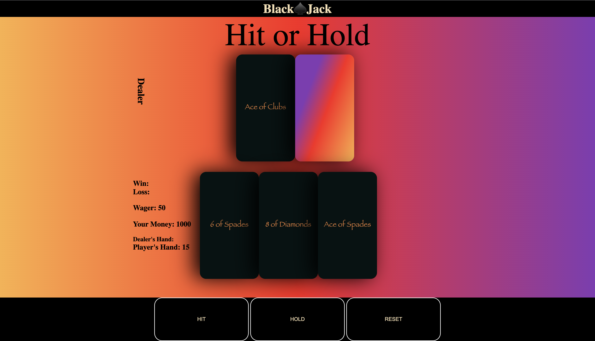

# Tyler Coats - Software Engineer ☕️
### Hi there 👋

Hi there!, I'm Tyler and I'm a software engineer based in the Atlanta area. I develop software applications using HTML, CSS, Git, GitHub, JavaScript, and React.js. I love video games especially ones with a competitive scene 🎮 

# Skills

  
  
  
  

  
  
  

# Projects

## BlackJack:
### To Play Press [HERE](https://blackjacktcc.surge.sh/)
I developed a fun and interactive version of the classic game Blackjack using HTML, CSS, and JavaScript. This project allowed me to showcase my skills in front-end web development and my passion for creating a modern UI with basic CSS.
### Game Preview

# Experience
-Completing 480 hours of expert-led instruction in JavaScript, Python, React, Django, Node.js, and hands-on learning of full stack software development in the industry's most in demand technologies.

# Contact Me
Feel free to reach out to me on coatsctyler@gmail.com or [LinkedIn](https://www.linkedin.com/in/tylerccoats/)

Thanks for visiting my profile!
